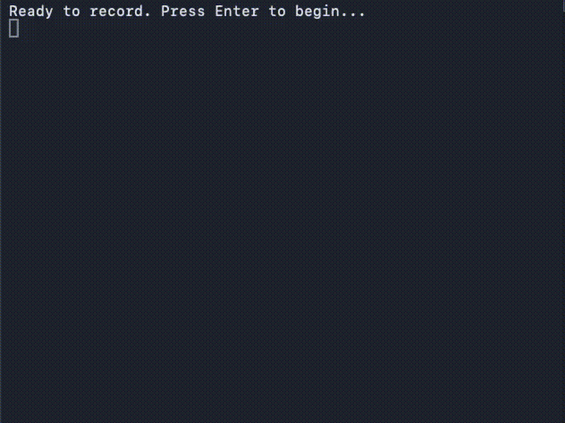

# claude-tab-tracking

[English](README.md)

> 一眼掌握每个 Claude Code 会话的工作状态。

<!--  -->

为 [Claude Code](https://docs.anthropic.com/en/docs/claude-code) 提供实时任务追踪。自动显示每个会话正在做什么，并随对话进展实时更新。

同时运行多个 Claude Code 会话时，切换窗口即可一眼看到每个会话的当前任务。

## 效果展示

```
[WIP]  修复 api/routes.py 中的认证 bug
[DONE] 部署模型到生产服务器
       my-project  |  ctx 14%  |  23min
```

**状态标识：**
- `[---]` — 会话刚启动，显示目录和 git 分支
- `[WIP]` — 任务进行中，每轮对话自动更新
- `[DONE]` — 任务已完成（自动检测）
- `[SET]` — 通过 `/task` 手动设置的任务

当完成一个任务并开始新任务时，上一个任务会以暗色 `[DONE]` 保留在当前任务下方。

## 工作原理

四个 Claude Code hooks 协同工作：

| Hook | 功能 |
|------|------|
| `SessionStart` | 写入 `目录 [分支]` 作为初始标签 |
| `Stop` | 每次助手回复后：读取对话记录，更新任务描述，检测完成状态 |
| `TaskCompleted` | Claude 明确完成任务时标记为 `[DONE]` |
| `SessionEnd` | 清理会话状态文件 |

### 摘要生成后端（自动检测，无需配置）

插件自动选择最佳可用后端：

| 优先级 | 后端 | 质量 | 成本 |
|--------|------|------|------|
| 1 | Claude API（需设置 `ANTHROPIC_API_KEY`） | 最佳 | 约 $1/月 |
| 2 | Ollama（本地模型） | 良好 | 免费 |
| 3 | 关键词匹配 | 基础 | 免费 |

无需额外设置，开箱即用。设置 `ANTHROPIC_API_KEY` 环境变量可获得最佳效果。

## 安装

需要 [jq](https://jqlang.github.io/jq/)：
```bash
brew install jq  # macOS
apt install jq   # Debian/Ubuntu
```

然后：
```bash
git clone https://github.com/lighthouse-strategy/claude-tab-tracking.git
cd claude-tab-tracking && ./install.sh
```

打开新的 Claude Code 会话，状态栏立即生效。

## 手动设置任务

使用 `/task` 命令为当前会话设置自定义描述：

```
/task 审查 Q1 策略报告
```

这会写入 `MANUAL:` 前缀，锁定描述并停止自动更新。状态显示为 `[SET]`。

## 安装的文件

| 文件 | 用途 |
|------|------|
| `~/.claude/scripts/session_start.sh` | SessionStart hook |
| `~/.claude/scripts/dynamic_task_update.sh` | Stop hook（bash 封装） |
| `~/.claude/scripts/dynamic_task_update.py` | Stop hook（对话解析 + LLM 摘要） |
| `~/.claude/scripts/task_completed.sh` | TaskCompleted hook |
| `~/.claude/scripts/session_statusline.sh` | 状态栏渲染 |
| `~/.claude/scripts/session_end.sh` | SessionEnd 清理 |
| `~/.claude/commands/task.md` | `/task` 命令 |
| `~/.claude/session-tasks/` | 会话状态（7 天后自动清理） |

## 卸载

```bash
rm -f ~/.claude/scripts/session_start.sh \
      ~/.claude/scripts/dynamic_task_update.sh \
      ~/.claude/scripts/dynamic_task_update.py \
      ~/.claude/scripts/task_completed.sh \
      ~/.claude/scripts/session_statusline.sh \
      ~/.claude/scripts/session_end.sh \
      ~/.claude/commands/task.md
rm -rf ~/.claude/session-tasks/
```

然后从 `~/.claude/settings.json` 的 `hooks` 中删除 `SessionStart`、`Stop`、`TaskCompleted`、`SessionEnd` 条目，并删除 `statusLine` 键。

## 作者

由 [lh-strategy](https://github.com/lh-strategy) 构建

## 许可证

MIT
